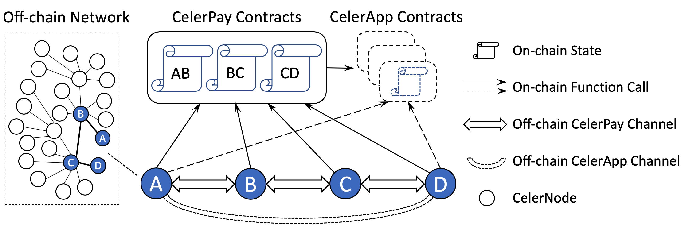

# Celer Channel Overview

Layer-1 blockchain systems have shown dramatic potential in disrupting many industries. However, their discouraging performance, including high cost, low throughput and high latency, impede the massive adoption of blockchain applications. By moving transactions to the layer-2 off-chain systems instead of broadcasting transactions through slow consensus process, we can achieve horizontal scaling, instant finality, drastically lower cost and more privacy.

This chapter introduces the design and implementation of a production-ready, highly scalable and reliable state channel network. We assume readers have basic knowledge of generalized state channels described in the [introduction chapter](../intro/introduction.md). Celer's state channel network is a generic framework of state channels with deeply optimized on-chain contracts and off-chain messaging protocols. While the initial implementation is based on Ethereum, the core framework and protocols are designed to be flexible and blockchain-agnostic, able to be quickly integrated with other layer-1 blockchains with minimum efforts.

---
## System Architecture

Figure above depicts the high-level architecture of Celer state channel network. A primary design decision is to decouple the payment and app state channels in order to significantly reduce the complexity and improve the scalability of the whole system. As shown in the figure, there are three key components in the system: *CelerPay*, *CelerApp*, and *CelerNode*.

**CelerPay** is the generalized payment channel that supports efficient off-chain token transfer with arbitrary conditions on on-chain verifiable states. It consists of a set of on-chain smart contracts and off-chain communication protocols. The shared smart contracts maintain the minimum required on-chain states for each pair of channel peers. The off-chain protocols specify how peers update and exchange off-chain states, and when to make the rare on-chain function calls. CelerPay channels are the edges of the state channel network. An off-chain payment can be multi-hop and traverse through multiple CelerPay channels.

**CelerApps** are generic state channels that can express any application logic. They expose the standard query APIs required by CelerPay, so that payment conditions can be based on CelerApp outcomes. Dashed lines in the figure above indicate CelerApps could be *virtual* modules. An app contract can be either initially deployed once by the developer and shared by all the future players; or used as a one-time *virtual contract* for fixed session participants (e.g., *A* and *D* in the figure) without on-chain deployment unless dispute happens. The CelerApp off-chain channel is always virtual, as no on-chain initialization (e.g., OpenChannel transaction) is required. As a result, CelerApp peers can directly communicate with each other without multi-hop state forwarding.

**CelerNodes** are the endpoints that run the state channel protocol of CelerPay and CelerApps. A node can join the state channel network by setting up a CelerPay channel with another node in the network. Once the CelerNode joins the network, it can send off-chain payments to any other nodes in the network. Though the Celer state channel technical architecture supports a homogeneous P2P network, we envision in real-world cases there will be two types of CelerNodes (running the same protocol) with different goals and characteristics:
- **Off-chain Service Provider (OSP)** is always online to relay payments for their peers. An OSP usually has more capital reserve to open CelerPay channels with many peers, and strong technical capability to maintain a highly available and reliable service.
- **Client** uses the state channel services. A client only needs to open a CelerPay channel with an OSP to become a leaf of the network. It can have as many virtual CelerApp channels with any other nodes, while all payments of the same token type will go through the same CelerPay channel with its OSP. A client could be offline when not using the services.

**Note on decoupled architecture.** Throughout the documentation, a topic that will be revisited many times is the *decoupled architecture*. CelerPay and CelerApp are loosely connected through the simple conditional dependency interface. This allows CelerPay use cases to go significantly beyond state channel applications, because off-chain conditional payment sent through the CelerPay network can be resolved as long as there is an on-chain verifiable conditional state. Some immediate use cases include sending a conditional payment with dependency on an outcome from an on-chain oracle, a smart-contract, or a layer-2 commit-chain.

---
## Design Principles

Our goal is to build a high-performance and cost-efficient dApp platform and value transfer network, with no compromise on the security or trust-free guarantee. The protocol design should follow a careful analysis of activity, cost, and failure patterns in real-world application platforms. We hold several design principles as below when building the Celer state channel network. Though every principle is critical to the system, there are still minor trade-offs need to be made when different principles slightly conflict with each other. Below we list them *in the order of priority*.

### Minimize on-chain footprint
On-chain transactions are expensive and slow, so the top priority is to make state transitions always stay off-chain, and only resort to on-chain operation when absolutely necessary (e.g., when two parties disagree on a state, or deposit/withdraw fund to/from the channel).

Another important aspect is to minimize the cost of each on-chain operation through deep smart contract optimization. Some common practices (ranked by importance) includes avoiding contract deployment by users, minimizing the number of transactions per business-level operation, minimizing on-chain storage per channel.

### Minimize relay node on-chain interaction
One essential lesson we learned from building various large-scale robust distributed systems is to push the complexity to the edge, which also applies to building a robust state channel network. The off-chain protocol should make sure the intermediate nodes have minimal possibilities to perform on-chain transactions or view function calls when relaying off-chain payments, and push the responsibilities of on-chain dispute to the end-to-end payment sender/receiver and app users. This end-to-end principle makes the network much easier to scale and defend against malicious attacks.

### Minimize on-chain view calls
People may have the illusion that on-chain view calls are free and can be used whenever they want. Actually on-chain view calls can quickly become a bottleneck if not used carefully when running an off-chain service in production, mainly for two reasons: 1) from a cost perspective, most entities have to rely on other services like [Infura](https://infura.io/) or [Alchemy](https://alchemyapi.io/) to view on-chain information, and have to pay them in order to receive a high-throughput and reliable service; 2) from a performance perspective, on-chain view calls are often much slower than fetching data from local storage servers or exchanging information with state channel peers.

### Minimize off-chain communication overhead
Though off-chain communication is much faster than on-chain interaction, it still needs to be optimized for better performance and reliability. There are two major overheads to be minimized for each business-level operation: *message round trip* and the *storage IO*. The detailed off-chain protocols are described in later [CelerPay off-chain](./pay_protocol.md) and [CelerApp](app.md) sections

### Enable low-cost decentralized system upgrade
One common issue about layer-1 blockchains is the great difficulty to upgrade since it requires global consensus. State channel has the advantage to be able to perform per-channel upgrade as long as all the channel peers agree. However, if not well designed, this upgrade process may still be annoying, which could involve multiple on-chain transitions and long off-chain downtime per channel. Celer enables zero-downtime and low-cost system upgrade through structured contract design and the use of protobuf, which will be detailed in later sections.

---
## Platform Interoperability

Celer Network aims to become a platform-independent layer-2 scaling platform running across different layer-1 blockchains that support smart contracts. Therefore, we need to design data structure and object interaction logic that works for different blockchains, frameworks, and programming languages. A key design choice to serve this purpose is to use [Protocol Buffers](https://developers.google.com/protocol-buffers/) (protobuf) to represent all the core data structures.

Celer uses protobuf to serialize and deserialize messages exchanged during communication among off-chain nodes and interaction between off-chain nodes and on-chain contracts. Although platform-specific smart contract languages such as Solidity provides their own ABI encoding and decoding functions,
we choose to use protobuf for its proven flexibility, efficiency, extensibility, and platform neutrality.
With protobuf, Celer core data structures can be seamlessly used in off-chain communication protocols and instantly extended to other blockchains that we plan to support.

### Protobuf Messages
In order to support cross-platform interoperability, Celer components at different platforms need to support the same set of protobuf messages, which can be categorized into four groups:
- [chain.proto](https://github.com/celer-network/cChannel-eth/blob/master/contracts/lib/data/proto/chain.proto) is used only for interactions with CelerPay on-chain smart contracts.
- [entity.proto](https://github.com/celer-network/cChannel-eth/blob/master/contracts/lib/data/proto/entity.proto) has CelerPay core data structures for both on-chain and off-chain communications.
- [message.proto](https://github.com/celer-network/goCeler-oss/blob/master/proto/message.proto) is used only for CelerPay off-chain communication.
- [app.proto](https://github.com/celer-network/cApps-eth/blob/master/contracts/lib/proto/app.proto) is used for CelerApp on-chain and off-chain communications.

The definition and usage of these protobuf messages will be described in later sections.

#### Protobuf add-ons
There are plenty of [protobuf add-ons](http://bit.ly/2mlpXzg) which cover most of the popular languages that are suitable to build our off-chain systems. However, there was no such add-on for Solidity, which we use to implement our solutions on Ethereum. Hence we implemented a [Solidity library generator](https://github.com/celer-network/pb3-gen-sol) to decode proto3 messages within Solidity smart contracts efficiently. It supports proto3 native types and uses field option for Solidity native types.
