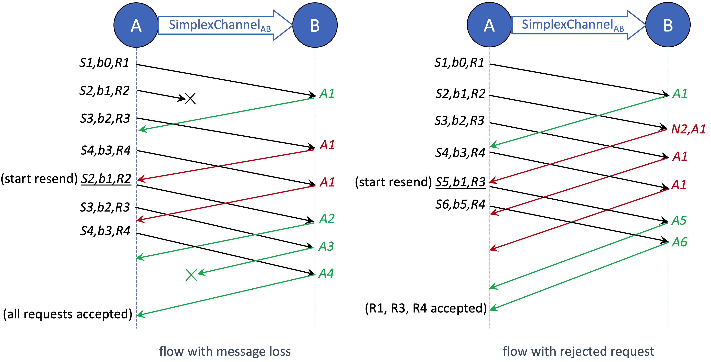
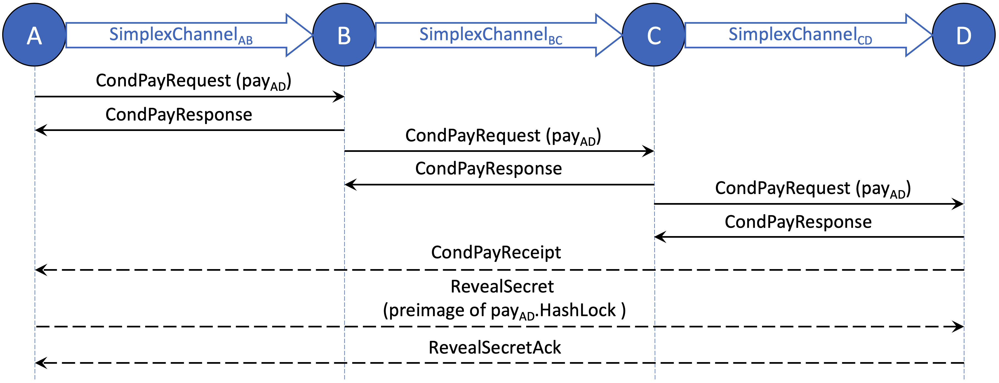
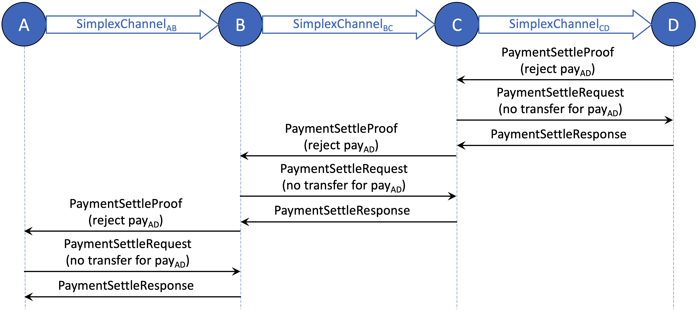
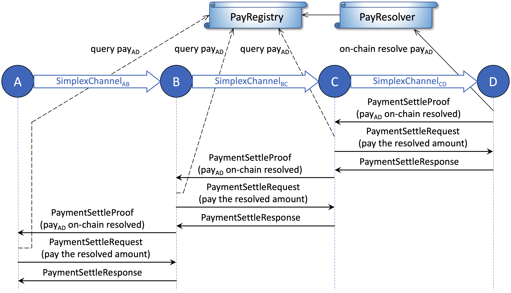
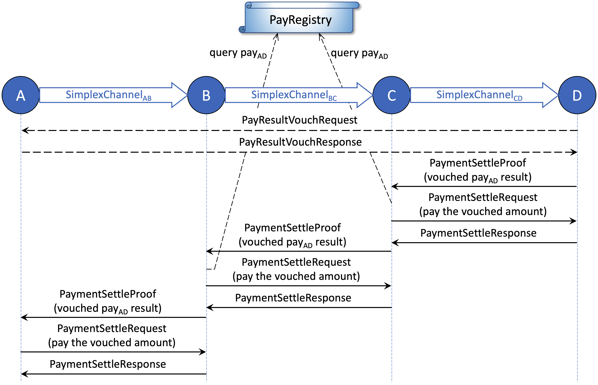
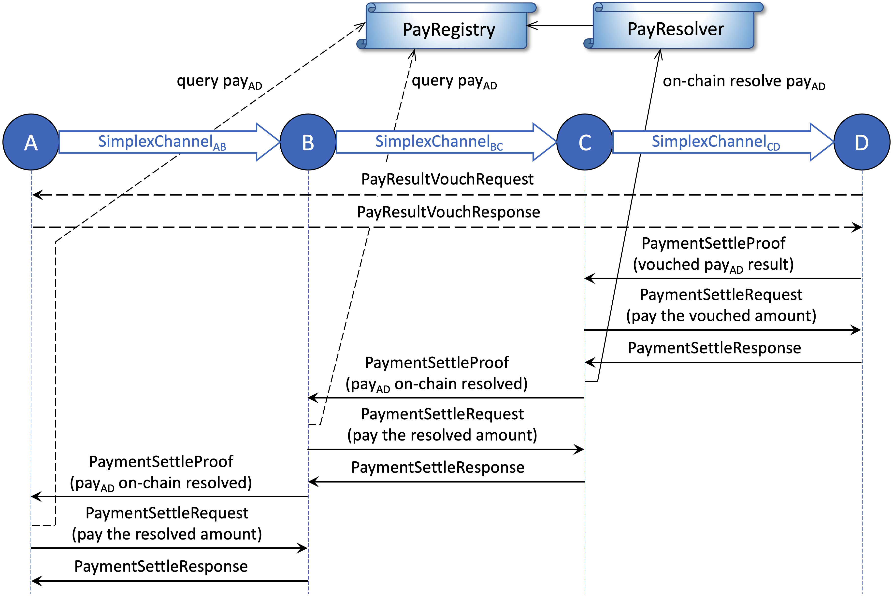

# CelerPay Off-Chain Protocol

This section presents both the hop-by-hop and end-to-end protocols used for CelerPay off-chain payments. CelerPay achieves high-performance at both levels through two design decisions:

- At hop-by-hop level, by decoupling the shared payment channel into two unidirectional simplex states, two peers can send off-chain payments to each other concurrently at high speed.
- At end-to-end level, by decoupling the payment and app state channels, the overhead of multi-hop payment is minimized so that the off-chain network can easily scale out.

The rest of this page elaborates how the payment channel peers quickly update their off-chain states, and how the payment network efficiently delivers the multi-hop conditional payments.

The CelerPay off-chain protocol is implemented as a part of the [CelerNode](./overview.html#system-architecture). An open-source, production-quality implementation of CelerNode can be found at [goCeler-oss](https://github.com/celer-network/goCeler-oss).

---
## Single-Hop Operations

Single-hop conditional payment is the basic primitive for CelerPay mulit-hop payment network. It is the foundation of Celer Network's high performance, robustness, and flexibility. It is critical first to understand the single-hop [conditional payment data structure](./pay_contracts.html#core-data-structures) and the single-hop messaging protocol described in this section before learning about more complex constructs.

As described previously, CelerPay uses a [full-duplex channel model](./pay_contracts.html#duplex-payment-channel) to maximize off-chain transaction throughput. If the channel model were two peers sharing a struct with a single sequence number, then the peers have to share a lock to make sure they do not update the channel state at the same time, which would greatly limit the off-chain performance.

By using the duplex channel with two unidirectional channels with independent sequence numbers, the peers can send payments to each other by updating different simplex states at the same time. To eliminate concurrency conflict, the CelerPay protocol only allows the *peer_from* (field 2) of the [simplex payment channel](./pay_contracts.html#simplex-channel-state) to initiate the update of the simplex state. The off-chain state updates should always follow the same pattern: 1) *peer_from* sends a new state with its own signature to the other peer; 2) the other peer verifies the state and replies with the co-signed new state.

The single-hop operations in two directions of a payment channel are symmetric. Therefore, this section only presents the operations in one direction.

### Send Conditional Payment

Sending a conditional payment is essentially creating a new co-signed [simplex channel state](./pay_contracts.html#simplex-channel-state) to add a new entry in the pending payId list (field 5) and update other related fields. Two off-chain messages (`CondPayRequest` and `CondPayResponse`) in one round trip are involved during the process.

**`CondPayRequest`** is the single-hop message sent by the peer who wants to send or forward the conditional payment. It mainly consists of the following information:

- **Payment data**: the immutable [conditional payment](./pay_contracts.html#conditional-payment) message set by the payment source.
- **New one-sig state**: the new [simplex state](./pay_contracts.html#simplex-channel-state) with the signature of *peer_from*. The new state should have a higher sequence number (field 3), new pending payId list (field 5) that includes the new conditional payment ID, and updated channel metadata (field 6 and 7).
- **Base seq**: the sequence number of the previous simplex state on which this new state is based.
- **Pay note**: a payment note with *google.protobuf.Any* type that can describe any information which might be useful for off-chain communication.

**`CondPayResponse`** is the replied message from the receiving peer after checking the validity of every data field in the request. The response consists of two fields:

- **Co-signed state**: the latest co-signed [simplex state](./pay_contracts.html#simplex-channel-state). This state should be the same as the state in the `CondPayRequest` if the request is valid. Otherwise (e.g., invalid sequence number due to packet loss), the lastest co-signed state stored by the receiving peer is replied to the *peer_from* to help failure recovery (e.g., resending lost previous request).
- **Error**: an optional error message with the error reason and the sequence number of the errored request. The *peer_from* sender is responsible for remembering and finding out the sent request based on the NACked sequence number.

### Settle Conditional Payment

After a conditional payment is successfully setup, two peers can cooperatively settle the payment off-chain once the condition outcomes are finalized. Settling a conditional payment is essentially creating  a new co-signed [simplex channel state](./pay_contracts.html#simplex-channel-state) to remove an entry from the pending payId list (field 5) and update the transferred amount (field 4) and other related fields. Three off-chain messages (`PaymentSettleRequest`, `PaymentSettleResponse`, and `PaymentSettleProof`) are involved during the process. The third message is only used when the receiving peer wants to initiate the settlement.

**`PaymentSettleRequest`** is the single-hop message sent by the *peer_from* side of the channel to clear a payment. It mainly consists of the following information:

- **Payments to be settled**: a list of payment IDs to be settled, their settle reasons (e.g., fully paid, vouched, expired, rejected, on-chain resolved), and the settled amounts.
- **New one-sig state**: the new [simplex state](./pay_contracts.html#simplex-channel-state) with the signature of *peer_from*. The new state should have a higher sequence number (field 3), new pending payId list (field 5) that removes the IDs of settled payments, and updated transferred amount (field 4) and total pending amount (field 7).
- **Base seq**: the sequence number of the previous simplex state on which this new state is based.

**`PaymentSettleResponse`** is the replied message from the receiving peer after checking the validity of the request. It has the same two fields with the `CondPayResponse` described above: a co-signed simplex state, and an optional error message.

**`PaymentSettleProof`** is used by the receiving peer to initiate a settlement process. While the receiving peer is not allowed to create a one-sig state for the simplex channel, it can send this message to notify the *peer_from* side of the channel to start the channel state update. The message consists of two optional fields:

- **Vouched payment results**: the list of [vouched results](./pay_contracts.html#resolve-payment-by-vouched-result) co-signed by each payment's source and destination. The *peer_from* should then send settle request based on the vouched amounts. This field is only used for multi-hop payments with numeric conditions, which will be detailed [later](#pay-with-numeric-conditions).
- **Payments to be settled** (not through vouched results): a list of payment IDs to be settled, along with the settle proof reasons (e.g., expired, rejected, on-chain resolved). The *peer_from* should then evaluate the reasons and send settle requests accordingly.

### Sliding Window Protocol

The above sections describe the basic single-hop message flow for two channel peers to update their simplex states cooperatively. Similar to all communication protocols, if the *peer_from* sender always waits for the response of the previous request before issuing the next request, then the total throughput would be significantly limited by the round-trip processing time. A natural step forward is to improve the off-chain performance with the [sliding window protocol](https://en.wikipedia.org/wiki/Sliding_window_protocol).

One particular challenge of using sliding window is that the *message* for simplex state updates (including `CondPayRequest` and `PaymentSettleRequest`) is fundamentally different from the *packet* of common data transmission protocols such as TCP. Unlike TCP packets, simplex state update messages are strongly correlated: the simplex state in one message is always based on the state in the previous message. Therefore, one *invalid message will invalidate all the subsequent messages based on it*. CelerPay modifies the traditional sliding window protocol to address this challenge so that state update requests can be sent and processed at a much higher speed.  

Figure above shows the sliding window workflow for CelerPay simplex state updates in case of different types of failures, including message loss and invalid request. _**S**_ stands for the simplex state, _**b**_ stands for the base sequence number(introduced in the previous section), _**R**_ stands for the request purpose (e.g., send or settle a conditional payment). For example, *"S7,b4,R5"* indicates the message has a new one-sig simplex state with sequence number 7, which is updated based on the previous simplex state with sequence number 4, and the request purpose of this message is identified as *R5*. _**A**_ stands for acknowledgment (ACK), _**N**_ stands for negative acknowledgment (NACK). Note that the CelerPay sliding window protocol assumes the messages could be lost but always delivered in order guaranteed by the underlying data transmission layer such as [gRPC](https://grpc.io/).

---
## End-to-End Protocols
The rest of this page describes the life cycles of end-to-end multi-hop conditional payments. As introduced before, CelerPay supports highly generic conditional dependency and condition resolution function. Two examples expected to be commonly used are [boolean and numeric condition logics](./pay_contracts.html#transfer-function), for which we have built optimized protocol and "pre-compiled" transfer functions. Different protocols with specialized condition resolution logics can be abstracted and optimized from the powerful single-hop conditional payment primitives.

We use the "[End-to-End](http://web.mit.edu/Saltzer/www/publications/endtoend/endtoend.pdf)" principle to guide our design and push as much complexity as possible to the edge of the network. This is the only way to build a simple, high performance, and robust relay node implementation that can support large scale payment flows.

### Pay with Boolean Conditions

We first present the flow of payments with boolean conditions, which we expect to be most commonly used. Since the condition outcomes are either true or false, the final results of these payments are always either the full amount or zero.

The end-to-end off-chain payment protocol follows the Celer state channel design principles, specifically focuses on minimizing the [relay node on-chain interaction](./overview.html#minimize-relay-node-on-chain-interaction), [on-chain view calls](./overview.html#minimize-on-chain-view-calls), and [off-chain communication overhead](./overview.html#minimize-off-chain-communication-overhead). For payments with boolean conditions, **the relay nodes never need to check the content of the conditions or perform any payment-related on-chain transactions, even in case of arbitrary malicious nodes along the payment routing path**. This helps to build a highly robust and scalable core payment network to support a very large number of clients.

#### Properties of payment with boolean conditions
Following the end-to-end principle, we build the boolean conditional payment protocol with the properties below:

 - **Simple:** Relay nodes never care about application or condition logics.
 - **Secure:** Relay nodes are resilient to arbitrary malicious application or condition logics.
 - **Robust:** Relay nodes never need to actively monitor on-chain condition or payment states.
 - **Low on-chain cost:**  Relay nodes never send on-chain dispute for any payment.
 - **Low off-chain overhead:** Relay nodes never modify any payment messages. The number of message exchanges is optimized for both cooperative and uncooperative cases.

#### Set up end-to-end conditional payment

The process of setting up an end-to-end multi-hop conditional payment is the same for payments with boolean and numeric conditions. Figure below shows the message flow of payment source *A* sending a conditional payment to destination *D* through two intermediate relay nodes *B* and *C*.

The conditional payment is set up in simplex channels *A-B*, *B-C*, *C-D* sequentially following the [*send conditional payment*](#send-conditional-payment) process described earlier. After the destination *D* receives the `CondPayRequest` from *C*, it will send a `CondPayReceipt` message directly back to the source *A* to acknowledge the end-to-end receipt of conditional payment. The end-to-end conditional payment setup process is considered completed at this stage if the payment does not have a hash lock condition.

If a hash lock condition is included in the payment condition list to help set up the multi-hop conditional payment, then it is time for *A* to reveal the preimage of the hash lock to *D* through the `RevealSecret` message. The end-to-end conditional payment setup process is considered completed once *A* receives the `RevealSecretAck` from *D*.

#### Source pays in full amount on true outcome

After the conditional payment is successfully set up, nodes along the path can then cooperatively [settle the payment](#settle-conditional-payment) hop-by-hop. Figure below shows the message flow when the payment source initiates this process by paying the full amount to its peer. This can happen immediately after *A* receives the `RevealSecretAck` for a conditional payment with only one hash lock condition, or after the CelerApp boolean conditions associated with the payment are finalized (off-chain) to be true.

As depicted in the figure above, when a conditional payment should be paid in full amount, the cooperative off-chain settlement should always start from the payment source (*A*) and proceed hop-by-hop downstream towards the destination (*D*). The relay node (*B* or *C*) only pay its downstream peer after it receives the full amount from the upstream peer, so it can safely forward the request without any check for the payment conditions or query of the on-chain information.

#### Destination rejects the payment on false outcome

Figure below shows the message flow in case of the payment destination rejecting the payment. This should happen after the CelerApp boolean conditions associated with the payment are finalized (off-chain) to be false.

When a conditional payment should not be paid, the cooperative off-chain settlement always starts from the payment destination (*D*) and proceeds hop-by-hop upstream towards the source (*A*). The relay node (*B* or *C*) only rejects the payment from the upstream peer after it confirms that the payment has been canceled with its downstream peer, so that it can safely clear the payment without any check for the payment conditions or query of the on-chain information.

The payment rejection flow can also be triggered by a relay node (*B* or *C*) if it has accepted the conditional payment from the upstream peer, but cannot successfully forward the conditional payment to the downstream peer.

#### Dispute the payment on-chain

Above we have described the basic end-to-end message flows to send and settle a conditional payment *cooperatively*. If any node along the routing path does not follow the protocol properly, an on-chain dispute of the payment may be triggered. For payments with boolean conditions, **the relay nodes do not need to initiate the dispute process of any single payment, because they are never exposed to security risks while forwarding the requests.**

Only the payment source or destination are motivated to dispute the payment in case of uncooperative behaviors. Figure below shows the example message flow of the destination (*D*) starts to dispute the payment on-chain. This may happen when *D* does not receive the full amount of the payment as expected, which may be caused by failures from any upstream nodes (*A*, *B*, or *C*).

If not receive the settlement as expected, the payment destination *D* can choose to submit an on-chain transaction to [resolve the payment by conditions](./pay_contracts.html#resolve-payment-by-conditions). After the payment result is finalized on the PayRegistry, *D* should send the `PaymentSettleProof` message to the upstream peer *C* to ask for the settlement. On receiving the settle proof message with a reason code indicating the payment has been on-chain resolved, *C* should query the payment result from the PayRegistry to verify *D*'s claim, and then send the settle request to *D* to pay the on-chain resolved amount. Then the settle proof message should be sent upstream and the same process should be repeated hop-by-hop till the payment source *A*. If an upstream node (*A*, *B*, or *C*) does not cooperate even after the payment is resolved on-chain, which indicates the node could be malicious, then the downstream peer can choose to [close the payment channel](./pay_contracts.html#settle-close-channel). During the whole end-to-end process, the relay nodes never need to perform any payment-based on-chain transactions.

If the payment conditions become false, but the payment source *A* has not received the settle proof to cancel the payment as expected, *A* does not necessarily need to dispute the payment on-chain at its own cost, because the payment will be cleared off-chain after the resolve deadline, which will be discussed [next](#clear-expired-pays). If the payment source *A* wants to cancel the payment before the resolve deadline, it can choose to resolve the payment on-chain and then settle the payment off-chain with its downstream peer. We omit the message flow diagram for this uncommon case.

#### Clear expired pays

Each conditional payment has a resolve deadline (field 6 of the [ConditionalPay](./pay_contracts.html#conditional-payment) message), after which the payment will be expired if has not been settled off-chain or resolved on-chain. A node can safely clear the expired payments with its upstream and downstream peers because the payment can never be resolved on-chain as restricted by the PayResolver contract. When a node receives the settle request to clear an expired payment, in addition to verifying that payment resolve deadline is already passed, it should check the PayRegistry to make sure that the payment is not already finalized on-chain. Each CelerNode should periodically scan all its pending payments and clear the expired ones with its peers.

---
### Pay with Numeric Conditions

In addition to commonly used boolean conditions, CelerPay also supports [numeric conditions and resolving logics](./pay_contracts.html#transfer-function) as a pre-built transfer function and messaging protocol, which allow the payment result to be finalized at any amount from zero to the maximum amount (field 2 of the [TransferFunction](./pay_contracts.html#transfer-function) message) according to the arbitrary CelerApp logic. This would greatly increase the flexibility of Celer off-chain platform usage.

The end-to-end message flow of setting up the conditional payment with numeric conditions is the same with [the flow for payment with boolean conditions](#set-up-end-to-end-conditional-payment). If the payment result is the maximum full amount or zero, or if the payment is expired, then the settlement flow is also the same as described above. The major message flow differences come from the case when the payment result is a value between zero and the maximum amount, which are explained next.

#### Properties of payment with numeric conditions
Following the end-to-end principle, we build the numeric conditional payment protocol with the properties below:
- **Simple:** Relay nodes never care about application or condition logics.
- **Secure:** Relay nodes are resilient to arbitrary malicious application or condition logics.
- **Robust:** Relay nodes only need to call a single PayRegistry view function during settlement.
- **Low on-chain cost:** A payment only needs to be disputed once along the whole routing path.
- **Low off-chain overhead:** Relay nodes never modify any payment messages. The number of message exchanges is optimized for both cooperative and uncooperative cases.

#### Set up end-to-end numeric conditional payment

The process of setting up an end-to-end multi-hop conditional payment is the same for payments with boolean and numeric conditions, as [described above](#set-up-end-to-end-conditional-payment).

#### Settle the payment hop-by-hop upstream

Figure below shows the message flow of settling payment with numeric conditions when every node is cooperative. The process is started by the payment destination (*D*) when the payment should be paid in an amount larger than zero but smaller than the maximum.

The payment destination *D* should first send an end-to-end `PayResultVouchRequest` to the payment source *A* in order to create a co-signed [VouchedCondPayResult](./pay_contracts.html#resolve-payment-by-vouched-result) message. Then *D* can send `PaymentSettleProof` to the upstream peer *C* using the co-signed vouched result as the proof to show that both the payment source and destination have agreed on the result of the payment. *C* should first query the on-chain PayRegistry to make sure that payment has not been finalized at a smaller amount, then pay *D* the vouched amount off-chain. After receiving the response from *D*, *C* can use the same co-signed vouched result to ask for settlement with its upstream peer *B*, which would follow the same procedure. The source *A* does not need to query the on-chain registry before pay *B* the vouched amount because the vouched result is signed by itself.

The reason for the relay nodes to query the PayRegistry before sending the settle request is that if the payment is already finalized at a smaller amount (e.g., due to collusion of payment source and destination), then the relay node may have to pay the downstream peer more than it can receive from the upstream peer if it does not check in advance.

#### Dispute the payment with vouched result

After a relay node paid its downstream the vouched amount, it needs to make sure the same amount of tokens can be received from upstream. Otherwise, it has to dispute the payment on-chain with the co-signed vouched result message it has. Figure below shows an example of the relay node *C* to dispute the payment on-chain after it has paid *D* the vouched amount. This could happen when *C* is not able to receive the settlement from *B* in time, or it finds out malicious on-chain resolving (to a smaller amount) has been triggered by others.

The relay node *C* can submit an on-chain transaction to [resolve the payment by vouched result](./pay_contracts.html#resolve-payment-by-vouched-result). The PayResolver contract [guarantees](./pay_contracts.html#dispute-the-payment-result) that the finalized amount in the PayRegistry would not be smaller than the co-signed vouched result *C* submitted, which ensures that the relay node can receive at least the same vouch amount it has sent. After the payment result is finalized on the PayRegistry, *C* can send `PaymentSettleProof` message to the upstream peer, and the rest of the flow is similar to the [case](#dispute-the-payment-on-chain) for payment with boolean conditions.

Through simple analysis, we can conclude that the protocol for payment with numeric conditions is secure and stable because **each relay node is guaranteed that the amount of tokens it receives from upstream would be equal to or greater than the amount it has sent to downstream**.
