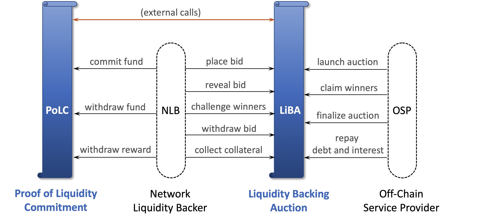
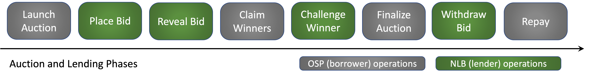

# Celer Liquidity Backing

Celer Liquidity Backing is part of the Celer cryptoeconomics, a.k.a. cEcnonomy. Its goal is to meet the [state channel network liquidity challenge](./problem.md) by creating a easy-to-access liquidity crowdlending market for off-chain service providers (OSP) to borrow funds to support their operations. Two core mechanisms of Liquidity Backing are Proof of Liquidity Commitment (PoLC) and Liquidity Backing Auction (LiBA), which are implemented in two separate smart contracts connected with external function calls. The two types of activity participants are OSPs who act as borrowers, and the Network Liquidity Backers (NLB) who act as lenders.

Figure above shows the architecture overview of liquidity backing. Blue vertical scrolls represent smart contracts; dashed rounded rectangles are participants of liquidity backing activities; black arrows are contract function calls from participants; orange arrow represents external function calls between smart contracts. Below we summarize the roles of the four major systems components.

- **Proof of Liquidity Commitment (PoLC)** is a process to incentivize and bootstrap crypto holders to lock in their idle liquidity (tokens) in the PoLC contract by rewarding them with CELR tokens and therefore establishing an initial stable liquidity pool. 
- **Liquidity Backing Auction (LiBA)** enables off-chain service providers to solicit liquidity through crowdlending. In essence, an off-chain service provider starts an on-chain LiBA process to borrow a certain amount of liquidity for a certain amount of time and pay the interest.
- **Off-chain Service Provider (OSP)** runs [CelerNodes](../channel/overview.html#system-architecture) to provide payment relay services. It usually needs a large amount of liquidity to expand and maintain its business to serve many clients, and thus may need to initiate auction to **borrow** tokens through LiBA.
- **Network Liquidity Backer (NLB)** is a token holder who locks its fund into the PoLC contract to get commitment reward, and may **lend** the tokens to OSPs through LiBA to earn interest.

---
## Proof of Liquidity Commitment

As described above, our goal is to lower the liquidity barrier for technically capable parties to become OSPs, and thus create an efficient and competitive market for good and reliable off-chain services. The first step to realize this goal is to provision an abundant and stable liquidity pool. To this end, we propose the Proof of Liquidity Commitment (PoLC) virtual mining process.

From a high level, the PoLC mining process is to incentivize people (NLBs) to lock in their idle liquidity (which can be in the form of digital assets, including but not limited to cryptocurrencies) in the PoLC contract for a certain period of time by rewarding them with CELR tokens. During this period of time when the digital assets are locked, the NLB’s assets cannot be used for anything else other than the liquidity backing process.

The PoLC mining power associated with a commitment is proportional to the asset value and lock duration, i.e., mining power will be the product of asset value and lock duration. Each block has a fixed amount of total reward. *The reward for a commitment by a given block will be proportional to the percentage of its mining power to the total mining power by the given block*. Formally, the PoLC reward calculation can be defined as the following.

**PoLC Reward.** For a given commitment ***i***, denote its asset value as  ***Vi*** and the lock duration as  ***Ti***, then its mining power ***Mi*** is computed as  ***Mi*** = ***Vi*** × ***Ti*** . Let ***R*** denote the total reward for a given block, then the reward ***Ri*** for commitment ***i*** at the block is computed as ***Ri*** = ***R*** × ***Mi*** / ∑*j****Mj*** , where the denominator is the sum of the mining power of all commitments locked in the given block.

Note that locked liquidity in PoLC does not carry any inherent counterparty risk as it simply shows a commitment to the Celer Network liquidity backing. Early unlocking of the committed fund is not allowed. *The only option to further make use of the locked tokens is to participate in the liquidity backing auction (LiBA) to earn more interest from the committed fund*.

---
## Liquidity Backing Auction

The second part for solving the liquidity puzzle is to enable a way for off-chain service providers to access to liquidity pool globally, which is achieved via the Liquidity Backing Auction (LiBA) process. An OSP initiates a LiBA process by announcing that it wants to borrow a certain amount of liquidity for a certain period of time, and specifying related auction and borrowing parameters. An interested liquidity backer (NLB) can submit a bid that contains the interest rate and the amount of liquidity to be offered, and the amount of CELR to be paid to the reward pool. Then OSP will confirm to borrow the liquidity from the winning bidders and pay the  auction fee in CELR to the reward pool. The borrowed liquidity will be used as a fraud-proof bond or outgoing state channel deposit.

Figure above shows the basic sequential operating phases for a liquidity backing auction. Grey rounded rectangles represent OSP operations, while the green ones represent NLB operations. LiBA is a generalized multi-attribute Vickrey-Clarke-Groves (sealed-bid second-score) auction, which we describe in detail in the rest of this page.

### Launch Auction

A qualified OSP can initiate an auction by specifying the asked token type and amount, the promised duration, the maximum acceptable interest rate, and other related parameters. As an implementation detail, LiBA contract computes interest on a daily non-compounding basis.

Optionally, the OSP borrower can collateralize the auction by providing a certain amount of tokens as collateral, so that the lenders will be compensated when the borrower cannot make the repayment. LiBA is designed to be *not* requiring over-collateralization, which is different from many existing lending DeFi products. The reason is that we expect most OSPs in a state channel network to be locally known identities (e.g., enterprises, foundations, exchanges, dApp hosts, wallet providers, research institutes), instead of the homogeneous "common" peers in many other DeFi settings. The main goal of LiBA is not for any anonymous individual to over-collateralize one liquidity in exchange for another (which LiBA also supports), but for known and reputable entities who want to operate OSPs be able to obtain liquidity from the potentially anonymous crowd. In the future release of LiBA, the borrowed liquidity will be restricted to only use as state channel deposits by the smart contracts, which will further lower the risk of fraud or fund misuse. 

### Place Bid

After an auction is launched, anyone (NLB) who has the same type of tokens in the PoLC contract can participate and place a blind bid by submitting a secret hash of the bid information to the LiBA contract. The bid information includes the token amount and interest rate offered by the bidder, and the amount of CELR token would be paid by the bidder if the bid succeeds.

CELR token serves two purposes for the bidder. First, there is a minimum CELR amount required by the contract. If the bidder placed a blind bid but did not reveal the bid information in the [later phase](#reveal-bid), then the staked CELR will be forfeited. Second, the amount of CELR to be paid for a winning bid is taken into account when ranking the bids. For bids with the same rate, the ones with more CELR have higher ranks. This will be further discussed [later](#claim-winners).

### Reveal Bid

After the blind bidding phase finishes, all bidders should reveal their bids within a certain amount of time. Each blind bid was submitted as a hash of the bid information and a salt selected by the bidder. The bidder just needs to submit the full bid information and salt for the LiBA contract to verify and record the revealed bid. As described above, a bidder who does not reveal the bid information will be penalized.

### Claim Winners

Following the reveal bid phase, it is time to figure out who are the bid winners, what interest rate will they get, and how much CELR should they pay. LiBA is a multi-dimensional second-price auction. All bids will be ranked by their offered interest rate from low to high. Bids with the same interest rate will be ranked by the amount of associated CELR tokens from high to low. Then the bidders will be put into the winner list in the order of their ranks, until the total amount of lending tokens has reached the asked amount by the borrower. As a second price auction, all winners will receive the same interest rate, which is the rate offered by the top loser, who has the highest rank excluding the winners. Winners who bid with a rate lower than the top loser's do not need to pay CELR, while winners who bid the same rate with the top loser's need to pay the CELR amount specified in the top loser's bid.

Technically, all these sorting and computations could be done on-chain as smart contract executions. However, it would be very expensive and slow, and may also be bottlenecked on the per-block gas limit. Instead, we choose a classic claim and challenge layer-2 approch. Borrower OSP would off-chain compute the auction bids locally and then on-chain claim the final results including the winner list and top loser. Note that the borrower OSP needs to keep its reputation, and does not have strong incentives to make a false claim.

### Challenge Winners

If the borrower OSP made a false claim, anyone who has been observing the auction process can challenge the claimed result. While the on-chain top-K sorting that we avoided could be expensive, challenging a claimed sorted list and proofing where goes wrong is a much cheaper process.

### Finalize Auction

After the challenge phase, borrower OSP can finalize the auction by paying the borrowing fee in CELR and receive the borrowed tokens from the winning bids, which will be transferred from the winning bidders' token pools in the PoLC contract.

**Borrowing Fee.** Same with other LiBA related fees, the borrowing fee will be paid to the PoLC reward pool. Let ***V*** denotes the total borrowed token value, ***T*** denotes the promised borrowed duration in blocks, ***M*** denotes the current total mining power of all blocks during the promised borrowed duration, ***R*** denotes the PoLC reward per block, then the borrowing fee paid by the OSP is ***F*** = ***(R × T) x ((V × T) x T) / M*** = ***R × V × T3 / M***. Here ***R × T*** is the total PoLC reward across the whole borrowing duration,  ***V × T*** is the mining power of the borrowed tokens at each block.

### Withdraw Bid

If the auction was not finalized by the OSP in time, or if the bid didn't win, the bidder should withdraw the bid to get back the CELR tokens paid during the placing bid phase. 

### Repay Debt and Interest

The OSP should repay the borrowed tokens and interest before the promised borrowing duration ends. If collateral was placed when the auction was launched. The repaid tokens will be transferred back to the lenders' PoLC commitments.

### Collect Collateral

If the OSP placed collateral when launched the auction, but failed the repay the debt and interest in time, then the lenders can collect the collateral as compensation in proportional to the amount of tokens they lent out.

