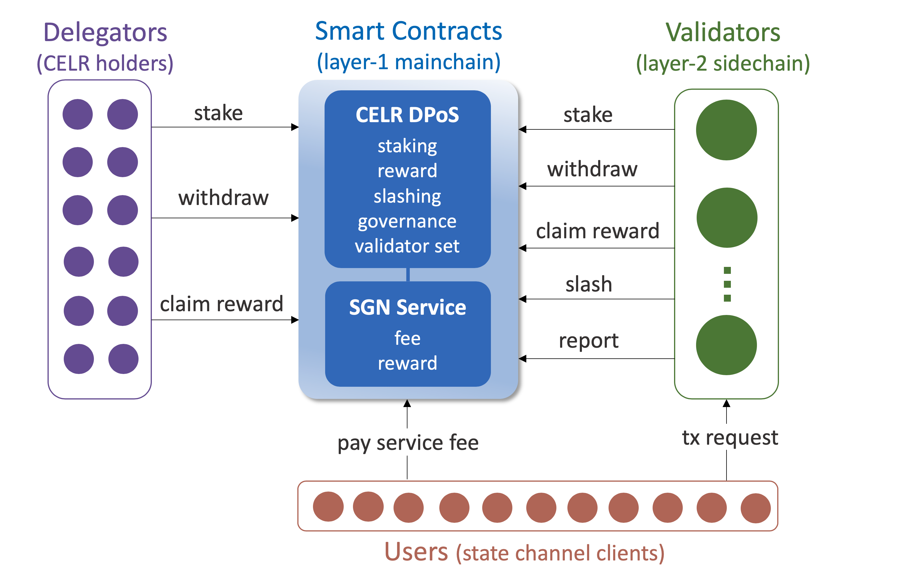

# SGN Architecture

State guardian network (SGN) is an efficient and scalable sidechain that offers highly reliable and decentralized [services](./availability.html#decentralized-solution) to eliminate the state channel [security risks](./availability.html#security-risks) and [usability hassles](./availability.html#usability-hassles) caused by the off-chain availability problem. 

This page introduces the SGN sidechain architecture. Later sections will describe the SGN service modules provided to the Celer state channel users, including [payment channel guardian](./guardian.md), delegated payment receiver, and app connectivity oracle.

---
## System Overview



Figure above shows the overview of SGN system. It mainly consists of four components: mainchain (layer-1) smart contracts, token delegators, sidechain (layer-2) validators, and sidechain users. Below we summarize the roles and responsibilities of each component:

- **Mainchain contracts** hold the CELR staking process. They specify and enforce the fundamental rules and configurations of roles, rewards, penalties, and fees for all network participants.
- **Delegators** stake their CELR tokens on the mainchain contract to vote on validators and governance proposals. Delegators receive their shares of SGN block rewards and service fees proportional to their stakes.
- **Validators** are elected by the delegators on the mainchain contract. They run sidechains under BFT consensus to offer SGN services, calculate reward distributions, and trigger penalty executions. Validators receive commission rewards from their delegators.
- **Users** are state channel clients who pay service fees to the mainchain contract and submit service requests to the sidechain.

Note that the figure above only depicts the high-level architecture. The actual function naming and workflow could be different and more complex. Some other components in the state channel ecosystems, such as CelerPay contracts (to which validators send guard tx) are not shown here.

### CELR Staking
Celer layer-2 platform uses delegated proof of stake (DPoS) to reward every shareholder on mainchain and enable fast transactions on sidechain. DPoS is a common consensus mechanism that uses a token staking and election process to achieve both decentralization and high performance in a blockchain system. It provides the opportunity for shareholders (delegators) to vote on potential sidechain validators by staking tokens on them so that every shareholder can make some influence on the network behavior and benefit from it. The properties of DPoS and its comparison with other consensus approaches have been extensively discussed in the blockchain community, so they will not be elaborated in this site. We have adopted some concepts and design choices from various DPoS mechanisms used in existing blockchains.

While SGN is a layer-2 sidechain, the staking process happens on the layer-1 mainchain. CELR shareholders interact with the mainchain contract to stake and withdraw their tokens, and to claim rewards. The validators elected on the mainchain produce, broadcast, and validate blocks for the sidechain. **The mainchain DPoS will be shared by all Celer layer-2 systems, including SGN and the upcoming hybrid rollup sidechain.** This site currently only describes the architecture of SGN.

### Loosely Coupled Architecture
SGN mainchain and sidechain are loosely coupled. This design enables higher flexibility, scalability, resilience, extensibility, and maintainability in each component. 

Mainchain contracts require elected validators to reach BFT consensus when reporting sidechain events but does not care how do they achieve it. It's up to the validator themselves to run their consensus protocol and produce sidechain blocks. More specifically, *mainchain contracts accept claimed sidechain events that are co-signed by validators collectively owning more than 2/3 of the voting power.* These events mainly include CELR rewards and penalties.

On the other hand, validators monitor and follow the mainchain events to adjust the sidechain settings accordingly, without caring about how the events are computed in detail. Whenever the *validator set* and *staking pools* on the mainchain contract change, the sidechain should immediately update its validator memberships and voting powers. Another mainchain state to follow is the *user service fee*, which is used by the validators to do sidechain service access control.

---
## Mainchain Contracts

The mainchain contracts have two parts. One is the single DPoS contract that provides the common functionalities such as CELR staking, validator election, reward, slashing, governance. The other is a set of sidechain contracts that offer different service logics while sharing the same DPoS framework. SGN sidechain is the first integrated service. Another sidechain contract being developed is the hybrid rollup service. Sections below focus on the DPoS and SGN sidechain contracts, which can be found at the [sgn-contract repo](https://github.com/celer-network/sgn-contract).

### Become a Validator

Anyone can initiate itself as a validator candidate on the mainchain contract. If the current number of validators is smaller than `max_validator_num`, the candidate can become a `bonded` validator when its staking pool meets the minimal staking requirements. If the number of validators has already reached the `max_validator_num`, then the candidate can become a validator only if its pool size is greater than the current smallest validator staking pool. The replaced former validator and its staking pool will go through an `unbonding` state, and then become `unbonded` after a timeout.

When submitting the `initializeCandidate` transaction, a validator candidate needs to specify a few parameters to help delegators to decide whether to stake on this pool:
- `min_self_stake` : Minimum amount of CELR from the validator itself to be staked in the pool. The staking pool will be unbonded if the validator's self-delegated stake falls below this limit.
- `commission_rate` : The commission rate on the staking rewards to its delegators. This value can only be updated after the lock end date specified below. When the validator wants to increase the rate, it also needs to announce the update two weeks before the new rate takes effect.
- `rate_lock_end_date` : The date until which the commission rate will be locked. This value can be updated anytime after initialization, but must be be monotonic increasing.

After the candidate is initialized, it should submit a `updateSidechainAddr` transaction to the SGN contract to claim its sidechain node address. When the candidate is eligible to become a bonded validator, it should call the `claimValidator` function to trigger the mainchain state transition.

### Delegate Stake

CELR holders including the validator itself can call the `delegate` function to stake on a validator by locking their tokens in the validator staking pool, which serve as collateral for the validator to provide secure and reliable services. Both the validator voting power and the pool reward are proportional to the amount of staked tokens in the pool. When delegator stake tokens on a validator, they share rewards as long as the validator follows the protocol, but also share the risks of getting punished if the validator misbehaves due to any reason.

### Withdraw Stake

If a validator is in `bonded` status, all tokens in the staking pool are also `bonded` as collateral and cannot be freely transferred. If a delegator wants to withdraw its tokens from a pool, it needs to issue an `intendWithdraw` request. Then the requested CELR tokens will be in `unbonding` status for a certain period, during which they are still liable to be slashed due to validator misbehaving. The requested tokens will become `unbonded` after the timeout and can be retrieved by the delegator through a `confirmWithdraw` transaction.

Tokens in the staking pool of an `unbonded` validator candidate can be directly withdrawn through a `withdrawFromUnbondedCandidate` transaction.

### Reward

Validators and delegators get rewards from both DPoS and SGN contracts. DPoS reward pool gets CELR tokens from the ScaleSphere foundation. SGN reward pool gets CELR tokens from the [service fees](#service-fee) paid by users. [Reward distribution](#reward-distribution) is calculated by the sidechain. Reward receivers need first to query the sidechain to get the reward message co-signed by the validators, then submit the message through the `redeemReward` function call to the SGN contract. 
```protobuf
message Reward {
    bytes receiver = 1 [ (soltype) = "address" ];
    bytes cumulative_mining_reward = 2 [ (soltype) = "uint256" ];
    bytes cumulative_service_reward = 3 [ (soltype) = "uint256" ];
}
```
On receiving a valid reward message co-signed by more than 2/3 voting power, the SGN contract will transfer the service reward to the receiver, and trigger the DPoS contract to transfer the mining reward to the receiver accordingly.

### Penalty

The DPoS contract also accepts reports from the sidechain to slash a portion of the stakes from [misbehaving validators](#penalties-for-misbehavior) and their delegators. Once the sidechain validators detect and reach consensus on who and how much to slash, they will co-sign a penalty message and submit to the DPoS contract through the `punish` transaction.
```protobuf
message Penalty {
    uint64 nonce = 1;
    uint64 expire_time = 2;
    bytes validator_address = 3 [ (soltype) = "address" ];
    repeated AccountAmtPair penalized_delegators = 4;
    repeated AccountAmtPair beneficiaries = 5;
}
```
On receiving a valid penalty message co-signed by more than 2/3 voting power, the DPoS contract will slash tokens from the penalized delegators (field 4) accordingly. By default, all slashed tokens will go to the shared DPoS reward pool. As will be [discussed later](#penalties-for-misbehavior), the penalty caused by service failure may specify beneficiary accounts (field 5) who can receive a portion of the slashed tokens.

### Governance

SGN is operated by a decentralized organization consists of all CELR holders. It requires a well-defined governance mechanism to coordinate any system changes, including contract upgrade, parameter update, new service launch, etc.

A mainchain contract governance process starts with a transaction to create a proposal. Any validator can vote with *yes*, *no*, or *abstain*. A two-thirds staking majority *yes* vote is required for the proposal to pass. Each proposal requires a deposit to prevent spamming. The proposer can only get back the deposit if the proposal passed. Otherwise, the deposit goes to the reward pool.

A more comprehensive mainchain governance mechanism will be introduced later to implement more rules and let all delegators participate in the governance process.

### Service Fee

Users who want to receive the SGN sidechain services should send payments to the mainchain contract. The fee structure is advertised by the sidechain as a subscription or pay-per-use model. In either case, the sidechain tracks the service usage and user remaining sidechain balances. A user should make an upfront lump sum payment on the mainchain, and then send as many sidechain service requests until the remaining sidechain balance becomes zero.

---
## Sidechain Consensus

The elected validators run the sidechain services under BFT consensus, which can tolerate up to 1/3 of the voting power failing arbitrarily. SGN chooses to use [Tendermint](https://tendermint.com) as the sidechain BFT consensus engine because of its flexibility and proven stability. SGN supports parallel sidechains to scale out the services and achieve ultra-high performance with no compromise on security or decentralization. This section describes how SGN sidechain consensus works in general. Later sections explain how to support each service in detail.

### Using Tendermint

SGN sidechain validators reach consensus through Tendermint, which is a blockchain software that performs BFT state machine replication on many machines. It is built with DPoS support, as the consensus is not based on two-thirds of the machines, but on proportions of the voting power of the machines. Its generic application interface allows developers to program their own deterministic finite state machine logic.

Validators run the SGN service as a Tendermint application so that all nodes have the same request execution logic and a consistent view of current states. The application consists of a set of modules for reward, slashing, state channel guard, sidechain governance, etc. The sidechain does not use a traditional gas model to charge fees for user each transaction. Instead, it performs access control for user requests according to the user service fee balance on the mainchain contract.

### Bridge with Mainchain

As [described previously](#loosely-coupled-architecture), mainchain and sidechain are loosely coupled, and the sidechain needs to follow the mainchain to adjust its states. Each sidechain validator runs a process to monitor the mainchain contracts, and follows a round-robin schedule to act as the `puller` to bridge infomation from mainchain to sidechain.

Once a mainchain event is caught, the current puller would send a `change` message to the sidechain, along with the event type and updated mainchain information. On receiving a new `change` message, all validators will independently verify the message by querying information on the mainchain contracts, and vote to accept or reject the message. Once the message is validated by more than 2/3 voting power, it will be applied to the sidechain state machine.

### Reward Distribution

Rewards are calculated on sidechain in each `reward_epoch`. They are distributed to the validator staking pools in proportion to their amounts in the current epoch. Each validator takes a cut from its staking pool rewards according to its `commission_rate`. Then all delegators share the rest of the staking pool rewards in proportion to their stakes in the pool.

Sidechain only calculates and records the reward distribution but does not transfer tokens on the mainchain. The reward receiver can query its reward anytime on the sidechain, and ask for a co-signed reward message from the validators in order to [claim the reward on the mainchain](#reward).

### Penalties for Misbehavior

The sidechain punishes misbehaving validator and its delegators by slashing a portion of the tokens from their staking pool on the mainchain contract. There are currently three slashing conditions:
- **Double sign blocks**. If a validator signs two conflicting blocks at the same height, it will get slashed by *X%*. The slashed tokens go to the reward pool.
- **Miss blocks**. If a validator misses more than 95% of the last *N* blocks, it will get slashed by *Y%*. The slashed tokens go to the reward pool.
- **Break service agreement**. If a validator fails to finish a service task during its assigned time slot, it will get slashed by *Z%*. Half of the slashed tokens go to the reward pool; the other half are rewarded to the validator who finished the same task at a later assigned time slot.

<!--### Sidechain Governance-->

### Horizontal Scaling

SGN can be easily scaled out by running multiple parallel sidechains due to the shared-nothing nature of the services it provides. Each type of service is entirely independent, so it can be run independently. All requests within a service can also be executed in parallel, because all SGN services are essentially storing and operating on the independent off-chain states for individual users. There is no double-spending problem in SGN sidechain.

All sidechains are run by the *same* validators. For example, if service A has *X* sidechains, service B has *Y* sidechains, and service C has *Z* sidechains, then each validator needs to run *X+Y+Z* machines for all the sidechains. Each service applies user-based sharding, which means requests from one user always go the the same sidechain, while different users may be served by different sidechains.

All sidechains follow the mainchain validator set and staking info under the same logic. The slashing conditions and reporting methods also remain the same, since the mainchain contracts only care about the validator signatures and votes.
