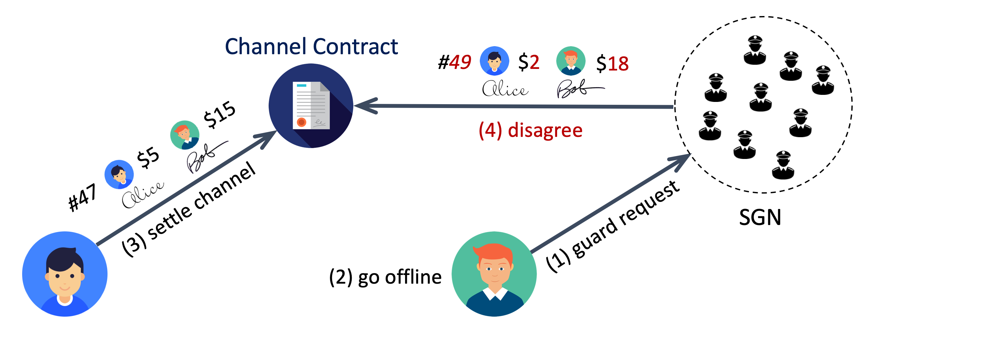

# SGN as Channel Guardian

Payment channel guardian is the most important service of SGN, as it eliminates the [security risks](./availability.md) of using payment state channel. A subscribed payment channel client can sync its latest off-chain state to the SGN sidechain and then safely go offline without worrying about losing its local data or channel being maliciously closed by its peer.

---
## Service Flow

Figure above illustrates the basic channel guardian service flow. Numbers in brackets show the order of the events. A subscribed user can keep sending `guardRequest` to the sidechain within its allowed request rate. The request is stored by all sidechain validators who also serve as channel guardians. Each guardian keeps monitoring the mainchain payment channel `IntendSettle` event. Once an event on a guarded channel is caught, the guardians will compare the attempt sequence number and the guarded sequence number, and respond to the settle event at its assigned time slot if the guarded number is larger. The guarded state can be retrieved by the user through the `getChannelState` sidechain API. There are two service modes at the user's choice.

### Fast Mode

The easy and straightforward way is to send a guard request that contains the latest cosigned state proof. When the guardian responds to a settle attempt, it just sends the `intendSettle` transaction with its guarded state proof. Then the channel is ready to be closed by whoever sending `confirmSettle` transaction after the settling process is finalized.

One potential concern of this fast mode is user privacy, as the sidechain validators see the user's every state proof from each guard request, from which one can construct the history of the user's off-chain balances. The state proof contains pending pay IDs, which do not reveal any detailed info of the payment such as source, destination, or conditions. However, if many nodes along the off-chain payment routing path use channel guardian fast mode, then one may still be able to track the (partial) path of the payment. Nevertheless, we believe fast mode can meet the needs of most people, because most payment info is still private in this mode, and off-chain payments have strictly better privacy than on-chain payments anyway.

### Private Mode

If a user wants to hide its off-chain balance history, it can use private mode by including the following information in the guard request:

- **Cosigned channel, peer, sequence number**(`cps`). In order to be protected from malicious channel settle attempts without exposing more private info than needed, the user only needs to provide the minimal information `cps = <channel_id, peer_from, seq_num, signatures>` to the sidechain. Guardians who have this data can send `vetoSettle` transaction to stop the settle attempts with small sequence numbers, but cannot close the channel as in the fast mode. When the user comes back online, the channel will be still in operating mode.
- **Encrypted full cosigned state proof** (optional). This is only needed if the user wants to back up its local state proof but does not want to use centralized cloud storage services.

The cost of private mode is communication overhead. The payment channel peers need to cosign the `cps` in addition to the full simplex state for each off-chain payment. Note that a channel peer must make sure it has the cosigned full state before signing and sending out `cps` with the same sequence number. Otherwise, a malicious payment receiver can permanently block the channel being closed by keep vetoing all settle intents. Here is the safe off-chain message sequence for peer *A* to send a payment to peer *B* in private mode.

1. *A* sends *B* a new simplex state with *A*'s signature.
2. *B* replies to *A* with *B*'s signature of the new simplex state. Within the reply message, *B* also includes the separate `cps` info of the new simplex state with its own signature.
3. *A* receives the cosigned new simplex state, and replies to *B* with A's signature of the new `cps` data. *B* considers the payment receiving process completed after received the cosigned `cps`.

---
## Guardian Assignment

Though all validators store all user requests, only one response transaction is needed for one malicious settle attempt. The sidechain coordinates validators to guard each channel in a specific order. For each payment channel, the sidechain randomly selects *N* validators as the *assigned* guardians `G_1, G_2, ..., G_N` in a specific order, and makes the rest validators as *standby* guardians for this channel. Once a malicious settle attempt for this channel is caught, the dispute time window will be divided into *N+1* slots. Guardian `G_i` is responsible for sending the response transaction at time slot *i* if the previous assigned guardians did not finish the job. If an assigned guardian failed to guard the channel at its time slot, it would get *slashed*, and the part of slashed tokens from the guardian's staking pool will be rewarded to the later guardian who finished the job. If all *N assigned* guardians failed, any of the *standby* guardians could send the mainchain transaction to guard the channel and receive the slashed tokens from the assigned guardians.

---
## Security Analysis

The core advantage of SGN as channel guardian is decentralized trust and fault tolerance. From the user's perspective, there are two steps of the service flow: 1) request accepted by the sidechain; and 2) channel guarded by the sidechain. The first step requires BFT consensus, so the guard request will be accepted by the sidechain as long as validators with more than 2/3 voting power are following the system protocol correctly. Once the user gets a confirmation that the request has been accepted, the sidechain provides *trust any* guarantee for the second step, which means the user's channel is safe as long as *any* sidechain validator follows the protocol correctly. These are very strong security and reliability guarantees.
